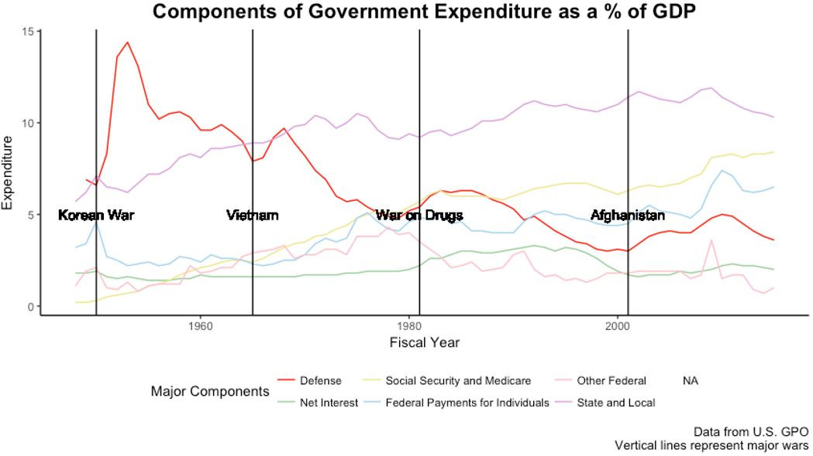

```{r setup, include=FALSE}
knitr::opts_chunk$set(width = 50)
```
```{r, echo = FALSE}
library(ggplot2)
```


# Course Logistics


## What is this class?

* The official course title is **Exploratory Data Analysis in R and Topics in Financial Literacy**
* Our goal is to motivate learning R through examples in finance and economics


## Who are we?

* A group of Federal Reserve Board Employees with a wide range of job titles: Economist, Technology Analyst, Financial Analyst, Research Assistant
* All of us are passionate about data, programming, and teaching.
* Lead Instructors/Course Organizers: Andrew Cohen, William Ampeh


## What will you learn in this class?

* How to handle and process data
* How to create meaningful tables and charts to communicate features of your data
* How to create and evaluate models
* **How to think critically about using data to address economic questions**


## How will you be evaluated in this course?

If you work hard and complete the assignments you will do very well in this course. Our goal is that work for this course should take 3-5 hours a week outside of class time. Please let us know how we are doing throughout the course.

* Homework (**35** %)
* Participation and attendance (**10** %)
    + Working with you classmates
    + Answering questions in class
    + Answering questions from your classmates on Piazza
* Take home midterm exam (**20** %)
* Final project with intermediate assignments (**35** %)

## Academic Integrity

Per the [Howard University Academic Code of Student Conduct](https://www.howard.edu/policy/academic/student-conduct.htm) we expect that you will:

* Work collaboratively on homework assignments but that each person will do their own write up of the solutions.

* Follow the guidelines for acceptable resources on the midterm exam.

* Cite all your sources on your project and that everything you write, even if it is just a summary of another paper, will be in your own words.

## How can you get help in this course?

We all know learning a new programming language is takes time. We want to be able to provide as much support as possible.

* Office hours at Howard 1-2 nights a week 6-8pm. We will post a tentative schedule and send email reminders.
* Piazza site allows you to ask questions and share code with everyone in the class and get answers quickly (average response time last semester was 1 hour)
* You will each be paired with an economist for your project who can help you work through the big picture issues you encounter (not for coding questions)
* [R for Data Science](http://r4ds.had.co.nz/)
* Google (Part of this week's homework)

## Course Timing

* Introduction to R and Rstudio
* Creating communicative graphics with ggplot2
* Data transformation with dplyr
* Data cleaning – strings and dates
    + Likely timing of the take home midterm exam
* Control flow and function writing
* Creating a replicable workflow with Rmarkdown
* Advanced Graphics
    + Midterm Presentations
* Regression
* Advanced topics
    + Projects Due and Final Presentations


# Getting Started with R

## Why R?

* R is a statistical programming language with similarities to Stata, SASS, Python ...
* R is open source (FREE!)
* R makes it easier to make research reproducible: [Reinhart and Rogoff](http://www.newyorker.com/news/john-cassidy/the-reinhart-and-rogoff-controversy-a-summing-up)
* The R language is designed to make working with data convienient
* People who do new stuff do new stuff in R
* R is great for graphics
* There is a huge online support community 
* Lot's of jobs are looking for people who can use R effectivily

## The end result!



## R objectives for today

* Make a time series plot of US GDP
* Learn how to navigate the Rstudio Integrated Development Environment (IDE)
* Understand the console and work space
* Run simple code at the command line
* Open and Save an R script

## Setting up your files for this class

Before we open up Rstudio and start coding we are going to walk through how you should organize your files for this class

* Make sure you are connected to the Board wifi
* Go to the website for this class
* Download all the files for lecture 1
* Create a folder in your documents called ECOG_314
* Make a subfolder for lecture 1

## Start/Open Rstudio

* Hopefully you have all already installed Rstudio
* If not please follow William's instructions to do so now
* If you have any difficulty let us know

# Work In RStudio

## How is Rstudio organized?

* Work space
* Console
* Environment / History
* File / Plot/ Packages/ Help
* Open a new R script (File -> New File -> R Script)
* Let's make a comment
* Save the R script in ECOG314 -> Lecture 1 as lecture_1.R
* Close Rstudio and open the file lecture_1.R

## Using R as a calculator

R has all of our familiar mathematical operations:

* Addition (+)
* Subtraction (-)
* Multiplication (*)
* Division (/)
* Exponentiation (^)

Try doing the following calculations 

* 3 plus 4
* 10043 plus 123548
* 3 times 5
* (6 plus 5 times 4) divided by 2
* 2 to the 5th power

## Coding at the command line

* At the command line type `1+1`
* Now try `x <- 1 + 1`
* What about `y <- x + 1`
* Click on the Environment tab. What does this window show you?
* Click on the History tab. What does this window show you?
* What is `x`? what is `y`?

## Variables in R

* What is a variable?
* We can assign variables using the `<-` operator. 
* Let's assign the value 41 to `x` and print the result
* How can we get information on a function (like print) in Rstudio? Using the ?function

## Variables in R continued

* Create a variable called **my_amazing_number** with a value of 1. Print out the value of my_amazing_number.
* Now add **x** to **my_amazing_number** and assign the result to a new variable called **the_best_number**. Print out **the_best_number**

## Variable Classes in R

* The class of a variable tells you what kind of values you can expect.
* The most basic classes or types of variables in R are:
  + Numeric – decimals like 1.1,3.1415926, 1000024.5
  + Integer – natural numbers like 1,2,3,4
  + Logical – Boolean values (TRUE or FALSE)
  + Character – text (often called strings) like “This is soooo cool!”, “I love R”
  + Factors - A way that R stores strings as numbers to speed up calculations
  + Dates - Don't worry to much about these yet
  + NA

## Variable Classes in R continued

* Create a variable called my_numeric that has the value 1.1
* Create a variable called my_integer that is 1
* Create a variable called my_logical that is TRUE
* Create a variable called my_character that is “one”
* Print out the value of each variable
* Check the class of each variable using the str() function
* What happens if you type as.character(my_numeric)?

## Boolean Values

* What happens if you type x == y into R?
* Test out some of these other logical operators:
    + ==
    + >, >=
    + <, <=
    + !=
* How can we combine logical conditions?
    + using or (|)
    + using and (&)


## Vectors in R

* We can create vectors in R using the c() function.
* The c() function combines values into a vector
* Try it out!
  + c(1,2,3)
  + x <- c(1,2,3)
  + c(x,x)
* Create a vector called numeric_vector with the values 1.1 , 2.2, 3.3
* Create a vector called character_vector with the values “a”,”b”,”c”
* Create a vector called boolean_vector with the values TRUE,FALSE,TRUE
* Print out each vector and get it's class
* What about the vector combined_vector <- c(1.1, "a", TRUE)?
* How could we test if 3 is in the vector x? (%in%)


## Keyboard shortcuts

* Ctrl + s: SAVE!
* Ctrl + Enter: Run current line/selection
* Ctrl + Shift + S: Source the current file
* Esc: Interrupt current command 
* Ctrl + L: Clear console
* Ctrl + Shift + F10: Restart R Session


## Let's take a step back


## Back to economics

* Why do we as aspiring economists and as world citizens care about the gross domestic product of a country?

* Why does the Federal Reserve care about this measure of economic activity?

* How might the Federal Reserve respond to changes in GDP?

## Looking at the data

* Read in GDP data from [FRED](https://fred.stlouisfed.org/series/GDPC1) using read.csv()

```{r, eval = FALSE}
read.csv("GDP.csv")
```

```{r}
gdp <- read.csv("GDP.csv")
```

* Look at the structure using str()

```{r, comment = NA}
str(gdp)
```

* What structure does R store this data as?

## Looking at the data continued 

* Let's get a quick look at the data using the head() function

```{r}
head(gdp)
```
* What does the head function do? How could you find the answer? What does the tail function do?

* Use the head function to look at the first 10 rows of data.

* Use the tail function to look at the last 8 years of data.

## GDP - Data Structure

* Let's take a closer look at the date column using the "$" operator

```{r}
str(gdp$DATE)

head(gdp$DATE)
```

* What does R tell us about the structure of this column?
* What about the other columns
* What is the frequency of these data?

## GDP - Data Structure

* Factors can be useful but are generally unpleasent to work with
* Let's go back and fix how we read in the data file

```{r}
gdp <- read.csv("GDP.csv", stringsAsFactors = FALSE)
```

* What's the structure of gdp now?

## GDP - plotting

* One of the best ways to understand data is to create a visualization.

* What would be a simple way of visualizing this time series?


## GDP - plotting data prep

* Before we can plot the data we need to convert the DATE column to be a Date type instead of a factor.
* How do we "access" the date column in the gdp data.frame?
* How do we assign variables?
* What does the as.Date() function do?

```{r}
gdp$DATE <- as.Date(gdp$DATE)
```

## GDP - plotting for real

* How many recessions can you see?

```{r, fig.height= 4}
ggplot(gdp) +
geom_line(aes(x = DATE, y = GDPC1))
```

## Wrapping up

* Please save all your code from class today! It will be very helpful going forward.
* There is a homework for this coming. Before you leave make sure you can open it!
