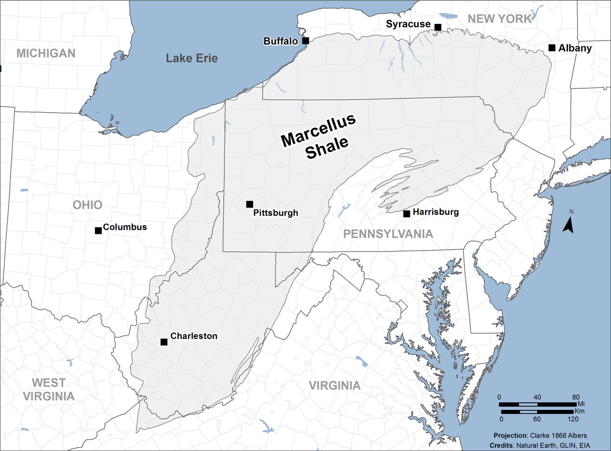
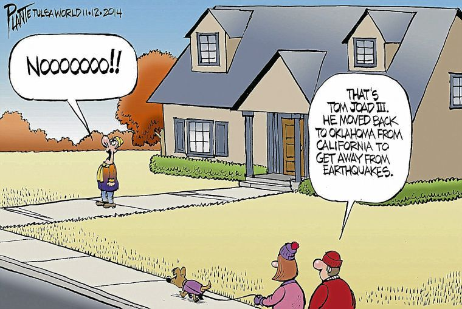

```{r setup, include=FALSE, message=FALSE, warning=FALSE}
knitr::opts_chunk$set(echo = TRUE, size = "tiny", width = 50, fig.height = 3.5, fig.width = 5)

library(tidyverse)
library(plotly)
library(gapminder)
library(maps)
library(stargazer)
library(ggthemes)
```


## Recap of Last Week

* Fixed Effects 

* Differences-in-Differences 

## Recap: Fixed Effects 

* Fixed effects are a tool that allow us to control for unobserved variation through the use of dummy variables 

* A \textbf{Factor Model} is an econometric model that uses fixed effects to control for the variation for the variables that are not of interest

* Pros
    * Can correct for omitted variable bias
    * Low computational cost

* Cons 
    * Need large amounts of data for your variables of interest to keep statistical significance  
    * Might lead to over fitting 
  
## Recap: Fixed Effects pt. 2

Suppose we have annual wage data for 20,000 individuals that spans from 2000-2017. We want to investigate what effect does \textbf{education} have on \textbf{wages}, so we estimate the following model 

$$ WAGES_{it} = \beta_0 + \beta_1EDUC_{it} + \epsilon_{it}$$
Where $WAGES_{it}$ is the annual wages and $EDUC_{it}$ is the years of education individual $i$ has in time $t$

* Is this Panel, Cross Sectional, or Time Series data?

* What are some omitted variables in this model? 

## Recap: Fixed Effects pt. 3

We can control for all of those omitted variables by using individual and time fixed effects! We now estimate the following model.

$$ WAGES_{it} = \beta_0 + \beta_1EDUC_{it} + \delta_i + \lambda_t + \epsilon_{it}$$
Where $\delta_i$ is a dummy variable for each individual and $\lambda_{t}$ is a dummy variable for each year!

* How many total dummy variables are there? Remember there are 20,000 individuals and the data spans from 2000-2017! 

* Is this model over fitted? 

* Can anyone think of any omitted variables now? 

## Recap: Fixed Effects pt. 4

* Fixed effects are a powerful and easy to use econometric tool

* They are fantastic at controlling for variables you do not have in your current data set! This means you do not have to merge in more data, or you can control of unobservable metrics! 

* They "soak up"" a lot of the variation, so as you include more fixed effects the statistical significance of your variables might be killed

## Recap: Differences-in-Differences 

* The ingredients
    * Treatment - policy intervention
    * Control group
    * Treated group

## Recap: Differences-in-Differences pt. 2

* Pros
    * Estimates the causal effect of the treatment in a rigorous and well understood manner 
    * Easy and fast to estimate
    * Flexible model - can be adjusted where the treatment is dynamic
    * Researchers are working on a tractable extension to logits/probits Athey(2006) and Blundell et al. (2009)
* Cons 
    * Very specific type of data 
    * Evidence of parallel trends 
    * Only describes the effect of treatment not how the mechanism works
    * Lacking in external validity 
  
## Recap: Differences-in-Differences pt.3 

* Last time we recreated Card and Kruger (AER 1994)

* The authors investigated if an increase in the minimum wage leads to a decrease in employment

* The ingredients 
    * Treatment - law that increased minimum wages
    * Control group - Pennsylvania
    * Treated group - New Jersey

* They find that there was no effect of the minimum wage increase on employment! 

* Any thoughts? What did they do well? What could have been improved? 
  
## Recap: Differences-in-Differences pt.4

```{r, height = 2, width = 5, echo=FALSE}
didData <- data_frame(Year = rep(2000:2004, 2),
                      Treatment = c(rep("Treated", 5), 
                      rep("Control",5)),
                      Y = c(3:5, 7, 9, 1:5))

counterfac <- data_frame(Year = rep(2000:2004, 2),
                         Y = rep(3:7, 2))

ggplot(didData, aes(x = Year, y = Y, colour = as.factor(Treatment))) +
  geom_line(lwd = 1.5) +
  labs(x = NULL, y = "Outcome", colour = "Treatment", title = "Example of Parallel Trends") +
  geom_line(aes(x = counterfac$Year, y = counterfac$Y), linetype = 4, lwd = 0.5) +
  geom_vline(aes(xintercept = 2002), linetype = 5) +
  theme_hc()

#Tidy up workspace
rm(didData)
rm(counterfac)
```

## Muehlenbachs et. al. (AER 2015 & WP 2015)  

* We are now going to walk through a more recent example of a paper that uses a difference-in-differences approach 

* The big research question for the following papers is; Did the fracking boom have an impact on housing prices? 

* This question was motivate by other natural resource booms in America, such as the gold rush!

## Muehlenbachs et. al. (AER 2015 & WP 2015) - The Marchellus Shale

```{r, echo = FALSE, out.width = "250px", out.height= "250px"}

```

## Muehlenbachs et. al. (AER 2015 & WP 2015) - The Marchellus Shale

* There is a gas rich geological area called the Marcellus Formation that spans primarily across NY, PA, and WV

* Until fracking and horizontal drilling innovations, extracting natural gas from this formation was too expensive. 

* Now the Marcellus shale is the largest producing geographic formation in America! As of 2013, it was producing 2836 billion cubic feet per year while the Barnett Shale in Texas was only producing 1952 billion cubic feet per year! 

## Muehlenbachs et. al. (AER 2015 & WP 2015) - Fracking Pros!


* Large economic boom in PA, ND, TX, and OK!
* Most of our electricity generation is being moved from diesel  
* [Economic Boom Article](https://www.bls.gov/opub/mlr/2014/article/the-marcellus-shale-gas-boom-in-pennsylvania.htm)

## Muehlenbachs et. al. (AER 2015 & WP 2015) - Fracking Cons!

```{r, echo = FALSE, out.width = "250px", out.height= "250px"}

```

## Muehlenbachs et. al. (AER 2015 & WP 2015) - Fracking Cons!

```{r, echo = FALSE, out.width = "250px", out.height= "250px"}

```

## Muehlenbachs et. al. (AER 2015 & WP 2015) - Fracking Ban in NY!

* In 2008 NY passed a law that stopped the issuing of additional drilling licenses, which halted any new wells from being drilled

* In 2014 NY bans non-conventional drilling in the Marcellus Shale! 

* [NY Bans Fracking!](https://www.nytimes.com/2014/12/18/nyregion/cuomo-to-ban-fracking-in-new-york-state-citing-health-risks.html)

* PA has yet to put any major restrictions on natural gas extraction.  

## Muehlenbachs et. al. (AER 2015 & WP 2015) - The set up 

* The authors collected data from 1994-2014 about how much natural gas each well is producing, the price of natural gas,  when new wells are being drilled, individual housing prices, and demographic data from the ACS. 

* In 2008 NY passed a law stopping any additional wells from being drilled in NY, while PA continued drilling new wells.

* The specific research question now becomes, what is the effect of the policy intervention that New York put in place have on housing prices?

## Muehlenbachs et. al. (AER 2015 & WP 2015) - The set up pt.2 

* From this description what is the treatment, the control group, and the treated group? 

## Muehlenbachs et. al. (AER 2015 & WP 2015) - The set up pt.3

* Last time, we just had one year for pre and post. Is it possible to manually take the differences like we did in the last class? 

* If we had to write down the regression how would it look? How would we do this in R?

* Hint: You need the interaction between the treated group and the treatment period! 

## Muehlenbachs et. al. (AER 2015 & WP 2015) - Regression

$$ HousePrice_{it} = \beta_0 + \beta_1NY+ \beta_2PRE + \beta_3POST*NY + \epsilon_{it}$$
Where NY is a dummy variable for New York, PRE is a dummy variable for 1994-2007, POST is a dummy variable for 2008-2014, and POST*NY is the interaction term between POST and NY.

* Where is the dummy variable for PA?

* What is the effect of the policy intervention in NY?

## Muehlenbachs et. al. (AER 2015 & WP 2015) - Findings 

* The authors use a triple diff-in-diff, which is just a fancier version of what we just did. It allows them to look at the effect of the fracking ban on different types of houses, while our set up lets us just to look at housing prices in general

* They find that the fracking ban increased the prices of homes who get their water from ground water resources while the prices of homes who get their water from other sources went down!

* This implies that fracking has driven the prices of homes who get their water from ground water down! Why could this be? 


## Game Plan for the Day 

* Investigate some development data 
    * Measuring growth vs. measuring development
    * Precanned objects in functions 
    * Relationship between wealth and development 

* Plotting maps in R
    * Create maps with ggplot
    * Incorporate data with maps 
  
## Packages with Precaned Data Frames 

  * Some packages include sample data frames to play around with when you install it
  
  * Examples include Starwars Movie characters, stock prices, and movie ratings 
  
  * Precanned data frames allow you skip loading data in, when you want to investigate the usage of the packages! 
  
## Loading in Precanned Data 
```{r, results = FALSE}
library(gapminder)
world_data <- gapminder
head(world_data)
```

## Quick Glance at the data
```{r, echo = FALSE}
knitr::opts_chunk$set(echo = FALSE)
options(width = 50) 
options(length = 50)

library(gapminder)
world_data <- gapminder
world_data$country <- as.character(world_data$country)
head(world_data)
```


## Quick questions about the data 

* What frequency is data reported at?

* What variable is measuring quality of life (i.e Development)?


## Development vs. Growth 

* \textbf{Economic Growth} is the study of how economies grow through technology, research, and investments innovations.

* What recent technological innovations do you think that have attributed to growth in the American economy?

* \textbf{Development Economics} is the study of how nations improve the economic, political, and social well-being of its people. 

* How can we measure development?

## The Relationship between Economic Growth and Development 

* Is there a correlation between a country's wealth and how "developed" it is?  

* How much of a country's development is due to the country's wealth?

* This is our research question for the day! 

* How would we investigate this relationship with our data? 

## Plotting the relationship between GDP Per Capita and Life Expectancy

```{r, echo = FALSE}
world_data %>%
  ggplot(aes(gdpPercap, lifeExp)) +
  geom_point() 
```

## In Class Exercise 1: Make a pretty plot!!!

* Y'all are now plotting pros! 

* Fix up the previous plot and differentiate the observations by Continent. 

* I would suggest to use scale_x_log10(), if you do not know what this function does please google it or type ?scale_x_log10() into you console 

## In Class Exercise 1: Solution - Output

```{r, echo = FALSE}
world_data %>%
  ggplot(aes(gdpPercap, lifeExp, color = continent)) +
  geom_point() +
  scale_x_log10() +
  xlab("Log of GDP Per Capita") +
  ylab("Life Expectancey") +
  ggtitle("Relationship of GDP Per Capita and Life Expectancy")
  
```

## In Class Exercise 1: Solution - Code

```{r, eval = FALSE, echo = TRUE, results='asis'}

world_data %>%
  ggplot(aes(gdpPercap, lifeExp, color = continent)) +
  geom_point() +
  scale_x_log10() +
  xlab("Log of GDP Per Capita") +
  ylab("Life Expectancey") +
  ggtitle("Relationship of GDP Per Capita and Life Expectancy")
  
```


## Creating a Benchmark Model 

```{r, echo = TRUE, results=FALSE}

benchmark <- lm(lifeExp ~ log(gdpPercap), 
                data = world_data)
stargazer(benchmark, type = 'text', header = FALSE)
```

## Interpreting and Performance our Benchmark Model 
* What dose a 1% increase in GDP Per Capita have on life expectancy? Remember that this is a level-log regression! 

* Is our coefficient statistically significant? Is it economically significant?

* What about missing variables that could explain the variation in Life Expectancy?

* Our data has its limits, but econometric tool can we use to improve the estimates? 

## Incorporating Time Fixed Effects 

```{r, echo = TRUE, results=FALSE}
time_fe_reg <- lm(lifeExp ~ log(gdpPercap) + factor(year), 
                  data = world_data)
stargazer(time_fe_reg, header = FALSE, type = 'text')
```

## Presenting Factor Models 

```{r, echo = TRUE, results=FALSE}
stargazer(benchmark, time_fe_reg, header = FALSE,
          type = "text",
          covariate.labels = c("Log GDP Per Capita"),
          omit = c("factor"), 
          add.lines = list(c("Time Fixed Effects?", 
                             "No", "Yes"))
          )
```


## Did Time Fixed Effects Help?

* How do we know? What tools did you use to say yes or no? 

* Still missing variables that explain the variation between countries 

* Let's add country fixed effects!

## In Class Exercise 2: Country Fixed Effects 

* Run a regression named "country_fe_reg" with just country fixed effects

* Run a regression named "both_fe_reg" with both time and country fixed effects 

* Put benchmark, time_fe_reg, country_fe_reg, and both_fe_reg into a stargazer table

* Please exclude the coefficients reported on the fixed effects, but indicate what regression has which fixed effects. 

## In Class Exercise 2: Solution

```{r, echo = TRUE, eval = FALSE}
benchmark <- lm(lifeExp ~ log(gdpPercap), 
                data = world_data)
time_fe <- lm(lifeExp ~ log(gdpPercap) + factor(year), 
              data = world_data)
country_fe <- lm(lifeExp ~ log(gdpPercap) + factor(country), 
                 data = world_data)
both_fe <- lm(lifeExp ~ log(gdpPercap) + factor(year) + 
                factor(country), data = world_data)

stargazer(benchmark, time_fe, country_fe, both_fe, header = FALSE,
          type = "text",
          covariate.labels = c("Log of GDP Per Capita"),
          omit = c("factor"), 
          add.lines = list(c("Time Fixed Effects?", 
                             "No", "Yes", "No", "Yes"),
                           c("Country Fixed Effects?", 
                             "No", "No", "Yes", "Yes"))
          )
```


## In Class Exercise 2: Interpreting Results

* What is the "best" model?

* Is the model with time and country fixed effects over-fitted?

## How do I pick what fixed effects to use?

* We could have done country fixed effects, but why did I suggest to do country fixed effects instead?

* Are some fixed effects "better" than others? 

* There is no "rule" on what type of fixed effects to use when, but there are "guide lines"...

## Vizualizing Data with Maps 

* Powerful tool

* Depicts clustering 

* We will be using another precanned data set from the 'maps' package

## Looking at the Map Data 

```{r}
world_map <- map_data("world")
head(world_map)
```


## Geographic Data in R 

* Think of the data as a bunch of points where R is smart enough to just draw lines through the points

* Ordering matters in this type of geospatial data - so don't go too crazy on it!!!

* There are many types of way to store geographic data, and the type of data we are working with is the easiest.

## Geographic Data in R pt. 2

* Mapping, in this lecture, works the exact same as a normal ggplot

* There is a new "layer" called polygon

* Note that the x variable is longitude and the y variable is latitude

* It common for people to say "lat, long" instead of "long, lat", either way to say it is fine, but when working with geographic data 90% of the time your x variable will be long and your y variable will be lat

## Our First Map

```{r}
world_map %>% 
    ggplot(aes(x = long, y = lat, group = group)) +
    geom_polygon(fill = "gray", color = "black", 
                 size = 0.3) +
    coord_equal()

```

## Our First Map - Improvements 

* What are some improvements we can make to this map?

* Since we are using ggplots we can make the same improvements in the same manner 

* The only tricky part is removing the axes 

## Our First Map - Removing the axes 

```{r, echo = TRUE, eval = FALSE}
no_axes <- theme(
  axis.text = element_blank(),
  axis.line = element_blank(),
  axis.ticks = element_blank(),
  panel.border = element_blank(),
  panel.grid = element_blank(),
  axis.title = element_blank())

world_map %>% 
    ggplot(aes(x = long, y = lat, group = group)) +
    geom_polygon(fill = "gray",
                 color = "black", size = 0.3) +
    no_axes +
    coord_equal()

```


## Our First Map - Pretty! 

```{r, echo = FALSE}
no_axes <- theme(
  axis.text = element_blank(),
  axis.line = element_blank(),
  axis.ticks = element_blank(),
  panel.border = element_blank(),
  panel.grid = element_blank(),
  axis.title = element_blank())

world_map %>% 
    ggplot(aes(x = long, y = lat, group = group)) +
    geom_polygon(fill = "gray",
                 color = "black", size = 0.3) +
    no_axes +
    coord_equal()

```


## Plotting a single continent 

* Take a look at our world_map data

* Can is there a continent field? 

* How can we fix this? 

* Luckily you know R and if you google enough there is almost always a package that does what you want!

## 'countrycode' package

* This package lets you take country names and map them to a country code, a continent, or a region 

* we will be using the countrycode() function from this package

* How do we see how a function works?

## Adding continent names with countrycode()

```{r, warning=FALSE}
# install.packages('countrycode')
library(countrycode)

world_map <- world_map %>%
  mutate(continent = countrycode(sourcevar = world_map[, "region"],
                        origin ="country.name",destination="continent"))
head(world_map)
```

## Plotting a single continent - Africa! 

```{r, echo = FALSE}
world_map %>%
  filter(continent == "Africa") %>%
  ggplot() + geom_polygon(aes(long, lat, group = group), 
                          fill = "grey", color = "black") +
  no_axes +
  coord_equal() 

```


## In Class Exercise 3: Plot your favorite continent! 

* First provide me a vector with the unique continents that we can map. How does it look?

* Provide me a dataframe of countries who have NA as their continent. Why do you think they are NA?

* Please plot your favorite continent, and change the color of the countries to your favorite color! 

## In Class Exercise 3: Solution pt. 1! 

```{r, echo = FALSE}

unique(world_map$continent)

```

## In Class Exercise 3: Soultion pt. 2! 

```{r, echo = FALSE}

NA_continent <- world_map[is.na(world_map$continent), ]
head(NA_continent)
```

## In Class Exercise 3: Soultion pt. 3! 

```{r, echo = FALSE}
world_map %>%
  filter(continent == "Asia") %>%
  ggplot() + geom_polygon(aes(long, lat, group = group), 
                          fill = "light green", color = "black") +
  no_axes +
  coord_equal() 

```

## Quick Spatial Data Style Aside 

* If you have noticed, throughout class there are certain "styles" to follow when programming in R and visualizing data 

* In this class we try to teach and follow the style laid out by Hadley Wickman (the R guru)

* Just like R, Spatial Data Science has some style rules

* One important rule, is that you should not make the color of countries or land blue! 

* Blue is reserved for water! 

## Let's add data to our maps! 

* Now that we are pros at plotting basic maps, lets add some depth to them! 

* The goal is now to visualize the GDP per capita and Life Expectancy between different countries using a \textbf{heat map}

* This means we must merge our world_map with our world_data 

* What variable will be merging on?

## Right Join or Inner Join? That is the question! 

* Assuming that we will merge the data frames with world_data being the left and world_map being the right data frame, should we use an inner or right join?

* Well lets try merging both ways and map Africa!

* From there we can pick which join we should use


## Inner Join 
```{r, echo = FALSE}
world_inner <- world_data %>%
  filter(year == 2007) %>%
  inner_join(world_map, world_data, by = c("country" = "region" ))
  
  
world_inner %>%  
  filter(continent.y == "Africa") %>%
  ggplot() + 
  geom_polygon(aes(long, lat, group = group), 
               fill = "grey", color = "black") +
  no_axes +
  coord_equal()

  
```

## Right Join 
```{r, echo = FALSE}
world_right <- world_data %>%
  filter(year == 2007) %>%
  right_join(world_map, world_data, by = c("country" = "region" ))
  
world_right %>%
  filter(continent.y == "Africa") %>%
  ggplot() + 
  geom_polygon(aes(long, lat, group = group), 
               fill = "grey", color = "black") +
  no_axes +
  coord_equal() 

  
```

## Right Join Wins - Why?

* Why are there holes in Africa when use the inner join?

* What is the difference between continent.x and continent.y? Which variable belongs to which dataframe?

* Now lets make our first heat map of life expectancy!!!

## Our first Heat map of Life Expectancy! 

```{r,  echo = FALSE}
world_right %>% 
  filter(continent.y == 'Africa') %>%
  ggplot() + 
  geom_polygon(aes(long, lat, group = group, fill = lifeExp), 
               color = "black") +
  no_axes +
  coord_equal()

```

## Improvements? 

* Why are there grey parts? 

* How can we make the map better? 

* Luckily, since we are using ggplot we can make improvements in the same manner that we have been doing!

## Improved Heat Map 

```{r,  echo = FALSE}
world_right %>%
  filter(continent.y == "Africa") %>%
  ggplot() + 
    geom_polygon(aes(long, lat, group = group, fill = lifeExp), color = "black") +
    no_axes +
    coord_equal() +
    ggtitle("Heat Map of Life Expectancy in Africa") +
    theme(plot.title = element_text(hjust = 0.5)) +
    scale_fill_distiller(palette = "Spectral")+
    guides(fill = guide_legend(title = "Life Expectancy"))
```

## In Class Exercise 4: European Heat Map 

* Please plot a heat map of the European countries' Per Capita GDP for the year 2007

## In Class Exercise 4: Code Solution 

```{r, echo = TRUE, eval=FALSE}

world_right %>%
  filter(continent.y == "Europe") %>%
  ggplot() + 
    geom_polygon(aes(long, lat, group = group, 
                     fill = gdpPercap), color = "black") +
    no_axes +
    coord_equal(ratio = 2) +
    ggtitle("Heat Map of GDP PC for Europe") +
    theme(plot.title = element_text(hjust = 0.5)) +
    scale_fill_distiller(palette = "Spectral") +
    guides(fill = guide_legend(title = "GDP Per Capita"))
```

